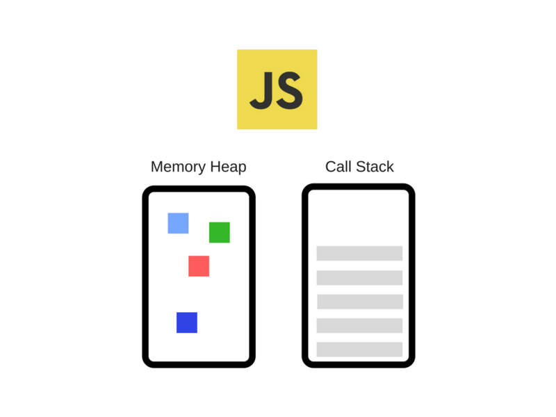
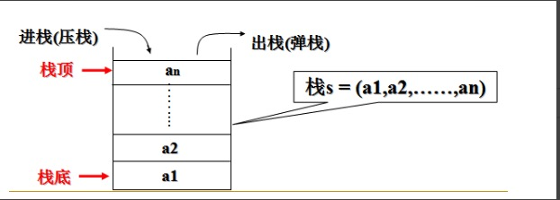
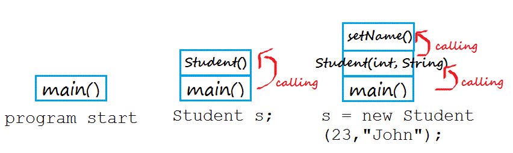
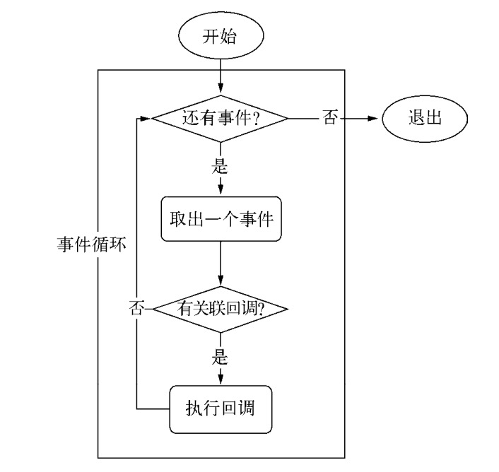
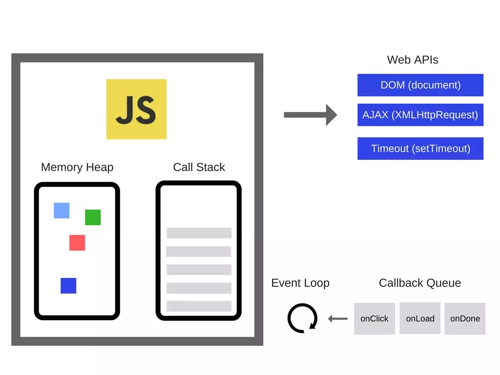
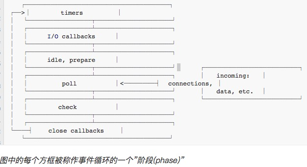

# JavaScript运行机制学习整理

## 一、JavaScript单线程模型

> JavaScript是单线程的，JavaScript只在一个线程上运行，但是浏览器是多线程的，典型的浏览器有如下线程：
- JavaScript引擎线程
- GUI渲染线程
- 浏览器事件触发线程
- 浏览器Http请求线程

## 二、JavaScript为什么是单线程的

> &ensp;&ensp;JavaScript之所以采用单线程 而不是多线程，由于作为浏览器脚本语言，主要用途是与用户互动，以及操作DOM（文档对象模型）和BOM（浏览器对象模型）， 而多线程需要共享资源，多线程编程经࣡常面临锁、状态同步等问题。<br/>
  &ensp;&ensp;假定JavaScript同时有两个线程，这两个线程同时操作同一个DOM增删修改操作，这时浏览器应该以哪个线程操作为准？无疑会带来同步问题。<br/>
  &ensp;&ensp;既然JavaScript是单线程的，这就意味着，一次只能运行一个任务，其他任务都必须在后面排队等待
  &ensp;&ensp;为了利用多核CPU的计算能力，HTML5提出了Web Worker，它会在当  前JavaScript的执行主线程中利用Worker类新开辟一个额外的线程来加载和运行特定的JavaScript文件，但在HTML5 Web Worker中是不能操作DOM的，任何需要操作DOM的任务都需要委托给JavaScript主线程来执行，所以虽然引入HTML5 Web Worker，但仍然没有改变JavaScript单线程的本质。


##  三、任务队列

  > Javascript有一个main thread 主进程和call-stack（一个调用堆栈），在对一个调用堆栈中的task处理的时候，其他的都要等着。当在执行过程中遇到一些类似于setTimeout等异步操作的时候，会交给浏览器的其他模块(以webkit为例，是webcore模块)进行处理，当到达setTimeout指定的延时执行的时间之后，task(回调函数)会放入到任务队列之中。一般不同的异步任务的回调函数会放入不同的任务队列之中。等到调用栈中所有task执行完毕之后，接着去执行任务队列之中的task(回调函数)。

  ### 1.异步和同步
  > 一般而言，操作分为：发出调用和得到结果两步

  #### 同步

  同步是指，发出调用，但无法立即得到结果，需要一直等待，直到返回结果。同步任务会进入主线程, 主线程后面任务必须要等当前任务执行完才能执行，从而导致主线程阻塞。

  #### 异步

  异步是指，调用之后，不能直接拿到结果，通过event loop事件处理机制，在Event Queue注册回调函数最终拿到结果（拿到结果中间的时间可以介入其他任务）。

## 四、JavaScript如何工作的，首先要理解以下几个概念

- JS Engine(JS引擎)
- Runtime(运行上下文)
- Call Stack(调用栈)
- Event Loop(事件循环)
- Callback(回调)

### 1.JS Engine

JavaScript引擎就是用来执行JS代码的, 通过编译器将代码编译成可执行的机器码让计算机去执行（Java中的JVM虚拟机一样）。
> 常见的JavaScript虚拟机（一般也把虚拟机称为引擎）：
- Chakra(Microsoft Internet Explorer)
- Nitro/JavaScript Core (Safari)
- Carakan (Opera)
- SpiderMonkey (Firefox)
- V8 (Chrome, Chromium)

>目前比较流行的就是V8引擎，Chrome浏览器和Node.js采用的引擎就是V8引擎。
引擎主要由堆(Memory Heap)和栈(Call Stack)组成

<div align="center">

</div>
<br/>

- Heap（堆） - JS引擎中给对象分配的内存空间是放在堆中的
- Stack（栈）- 这里存储着JavaScript正在执行的任务。每个任务被称为帧（stack of frames）。

主线程运行的时候，产生堆（heap）和栈（stack）,栈中的代码调用个各种外部api。

### 2.RunTime (运行环境)
JS在浏览器环境中运行时，BOM和DOM对象提供了很多相关外部接口（这些接口不是V8引擎提供的），供JS运行时调用，以及JS的事件循环(Event Loop)和事件队列(Callback Queue)，把这些称为RunTime。在Node.js中，可以把Node的各种库提供的API称为RunTime

### 3.Call Stack
当JavaScript代码执行的时候，创建执行环境是很重要的，它可能是下面三种情况中的一种：

- 全局 code（Global code）——代码第一次执行的默认环境
- 函数 code（Function code）——执行流进入函数体
- Eval code（Eval code）——代码在eval函数内部执行

>JavaScript代码首次被载入时，会创建一个全局上下文，当调用一个函数时，会创建一个函数执行上下文。

<div align="center">

</div>

>在计算机系统中栈是一种遵从**先进后出**（FILO）原则的<!--  -->区域。函数被调用时，创建一个新的**执行环境**，就会被加入到**执行栈**顶部，浏览器始终执行当前在栈顶部的执行环境。一旦函数完成了当前的执行环境，它就会被弹出栈的顶部, 把控制权返回给当前执行环境的下个执行环境。

案例：浏览器第一次加载你的script，它默认的进了全局执行环境，然后main执行创建一个新的执行环境，把它添加到已经存在的执行栈的顶部，在里面执行Student构造函数，执行流进入内部函数 将生成执行环境添加到当前栈顶，在Student构造函数里，又调用sayHi方法，再次把sayHi生成执行环境压入到栈顶。当函数执行完一次弹出栈顶。
```
class Student {
	constructor(age, name) {
		this.name = name;
        this.age = age;
		this.sayName(); // stack 3
	}
	sayName() {
		console.log(`my name is ${this.name}, this year age is ${this.age}`);
	}
}

function main(age, name) {
	new Student(age, name); // stack 2
}

main(23, 'John'); // stack 1
```
<div align="center">

</div>

> 程序运行时，首先main()函数的执行上下文入栈，再调用Student构造函数添加到当前栈尾，在Student里再调用sayName()方法，添加到此时栈尾。最终main方法所在的位置叫栈底，sayName方法所在的位置是栈顶，层层调用，直至整个调用栈完成返回结果，最后再由栈顶依次出栈。

### 4.Event Loop & Callback
Event Loop 类似于一个while(true)的循环，每执行一次循环体的过程我们成为Tick。每个Tick的过程就是查看是否有事件待处理，当Call Stack里面的调用栈运行完变成空了，就取出事件及其相关的回调函数。放到调用栈中并执行它。

<div align="center">

</div>

>调用栈中遇到DOM操作、ajax请求以及setTimeout等WebAPIs的时候就会交给浏览器内核的其他模块进行处理，webkit内核在Javasctipt执行引擎之外，有一个重要的模块是webcore模块。对于图中WebAPIs提到的三种API，webcore分别提供了DOM Binding、network、timer模块来处理底层实现。等到这些模块处理完这些操作的时候将回调函数放入任务队列中，之后等栈中的task执行完之后再去执行任务队列之中的回调函数。

<div align="center">

</div>

>Javascript有一个main thread 主进程和call-stack（一个调用堆栈），在对一个调用堆栈中的task处理的时候，其他的都要等着。当在执行过程中遇到一些类似于setTimeout等异步操作的时候，会交给浏览器的其他模块(以webkit为例，是webcore模块)进行处理，当到达setTimeout指定的延时执行的时间之后，task(回调函数)会放入到任务队列之中。一般不同的异步任务的回调函数会放入不同的任务队列之中。等到调用栈中所有task执行完毕之后，接着去执行任务队列之中的task(回调函数)。

```
代码案例：
console.log('Hi');
setTimeout(function cb1() {
    console.log('cb1');
}, 5000);

console.log('Bye');
```
以上代码从上到下 首先执行log('Hi') 它是一个普通方法立即被执行，当遇到定时器的时候，执行引擎将其添加到调用栈，调用栈发现setTimeout是WebAPIs中的API，将其出栈交给浏览器的timer模块进行处理，此时timer模块去处理延迟执行的函数，此时执行log('Bye'),输出'Bye'，当timer模块中延时方法规定的时间到了之后就将其放入到任务队列之中，此时调用栈中的task已经全部执行完毕。

<div align="center">

</div>

>调用栈中的task执行完毕之后，执行引擎会接着看执行任务队列中是否有需要执行的回调函数。


## 五、Event Loop处理机制

### 1.什么是Event Loop？
>Event Loop（事件循环）是实现异步的一种机制，允许 Node.js 执行非阻塞 I/O 操作 .

大多数现代的系统内核都是多线程的, 他们在后台可以处理多个同时执行的操作. 当其中一个操作完成时, 系统内核会通知Node.js, 然后与之相关的回调函数会被加入到 poll队列 并且最终被执行.

<div align="center">

</div>
<br/>
>注意: 在Windows和Unix/Linux实现之间存在一点小小的差异, 但对本示例来说这并不重要. 最重要的部分都已列在这里了. 实际上有7或8个阶段, 但我们关心的和Node.js实际会用到的阶段都已经列在了上面.

每个阶段都有一个先进先出（FIFO）的队列，里面存放着要执行的回调函数，然而每个阶段都有其特殊之处，当事件循环进入了某个阶段后，它可以执行该阶段特有的任意操作，然后进行该阶段的任务队列中的回调函数，一直到队列为空或已执行回调的数量达到了允许的最大值，当队列为空或已执行回调的数量达到了允许的最大值时，事件循环会进入下一个阶段

### 2.阶段概览
- timers(定时器)：此阶段执行由setTimeout()和setInterval() 调度的回调函数

- I/O callbacks(I/O回调): 此阶段会执行几乎所有的回调函数，处理close callbacks 和那些 由times与setImmediate()调度的回调

- idle(空转)，prepare: 此阶段只在内部调用

- poll(轮询): 检索新的I/O事件，在恰当的时候会阻塞在这个阶段

- check(检查): setImmediate() 设置的回调会在此阶段被调用

- close callbacks(关闭事件的回调): 诸如 socket.on('close', ...) 此类的回调在此阶段被调用

在事件循环的每次运行之间，Node.js会检查它是否在等待异步I/O或定时器, 如果没有的话就会自动关闭.

>一次事件循环就是处理以上几个phase的过程，此外还有两个比较特殊的队列Next Ticks Queue和Other Microtasks Queue，那另外两个特殊的队列是在什么时候运行的呢？<br/>
&ensp;&ensp;答案: 就是在每个 phase运行完后马上就检查这两个队列有无数据，有的话就马上执行这两个队列中的数据直至队列为空。当这两个队列都为空时，event loop 就会接着执行下一个phase。
这两个队列相比，Next Ticks Queue的权限要比Other Microtasks Queue的权限要高，因此Next Ticks Queue会先执行。

两个比较特殊的队列：
- Next Ticks Queue: 保存process.nextTick中的回调函数
- Other Microtasks Queue: 保存promise等microtask中的回调函数。

### 3.阶段详情
由于这些操作中的任意一个都可以调度更多的操作, 在 poll(轮询) 阶段处理的新事件被系统内核加入队列, 当轮询事件正在被处理时新的轮询事件也可以被加入队列. 因此, 长时间运行的回调函数可以让 poll 阶段运行的时间比 timer(计时器) 的阈值长得多。 看下面timer 和 poll 部分了解更多细节

#### timers
给一个定时器（setTimeout/setInterval）指定时间阈值时，给定的回调函数有时并不是在精确的时间阈值点执行，定时器的阈值只是说 至少在这个时间阈值点执行，然而操作系统调度或其他回调的执行可能会延迟定时器回调的执行。<br/>

*注意：从技术来讲， poll阶段会控制定时器何时被执行*

```
const fs = require('fs');

// 设定一个100ms执行的定时器
const startTime = Date.now();
setTimeout(() => {
	console.log('timeout延迟执行时间', Date.now() - startTime);
	console.log('timer');
}, 100);

// 异步读取文件 假设95ms完成读取任务
fs.readFile('./1.txt', (err, data) => { // 回调函数中又耗费100毫秒
	const startTime = Date.now();
	while (Date.now() - startTime < 200) {
		// console.log(Date.now() - startTime);
	}
});
```
>开始事件循环定时器被加入到timer中延迟执行，当事件循环进入poll阶段，它有一个队列执行I/O操作（fs.readFile()）还未完成，poll阶段将会阻塞，大约95ms 完成了I/O操作（文件读取），将要耗时10ms才能完成的回调加入poll队列并执行，当回调执行完成，poll Queue为空，此时poll会去timer阶段查看最近有没有到期的定时器，发现存在一个已经超时将近195ms的定时器，并执行定时器回调。在这个例子中如果不假设读取时间，定时器执行的时间间隔大约为200ms。

*注意: 为了防止 poll 阶段阻塞事件循环, libuv(一个实现了Node.js事件循环和Node.js平台所有异步行为的C语言库), 有一个严格的最大限制(这个值取决于操作系统), 在超过此限制后就会停止轮询.*

#### I/O callbacks
此阶段执行一些系统操作处理 I/O 异常错误；,如TCP的errors回调函数。

#### poll

poll 阶段主要有两个功能:

 1.执行时间阈值已过去的定时器回调

 2.处理poll队列中的事件

 ##### 当事件循环进入poll阶段并且 *当前没有定时器时*，以下两种情况其中一种会发生：

 - 如果poll队列不是空的，事件循环会遍历队列并同步执行里面的回调函数，直到队列为空或者到达操作系统的限制（操作系统规定的连续调用回调函数的数量的最大值）

 - 如果poll队列是空的，则以下两种情况其中一种将发生：
   - 如果存在被 _setImmediate()_ 调度的回调，事件循环会结束poll阶段并进入check阶段执行那些被 _setImmediate()_ 调度了的回调。

   - 如果没有任何被 _setImmediate()_ 调度的回调，事件循环会等待回调函数被加入队列，一旦回调函数加入了队列，就立即执行它们。

>一旦poll队列变为空，事件循环就检查是否已经存在超时的定时器，如果存在，事件循环将绕回到timers阶段执行这些定时器回调。   

#### check
此阶段如果poll阶段变为空转（idle）状态，如果存在被 _setImmediate()_ 调度的回调，事件循环不会在poll阶段阻塞等待相应的I/O事件，而直接去check阶段执行 _setImmediate()_ 函数。

#### close callbacks
如果一个socket或句柄被突然关闭(例如 socket.destroy()), 'close'事件会在此阶段被触发. 否则 'close'事件会通过 process.nextTick() 被触发.

#### setImmediate() vs setTimeout()

- setImmediate() 被设计为: 一旦当前的poll阶段完成就执行回调
- setTimeout() 调度一个回调在时间阀值之后被执行

这两种定时器的执行顺序可能会变化, 这取决于他们是在哪个上下文中被调用的. 如果两种定时器都是从主模块内被调用的, 那么回调执行的时机就受进程性能的约束(进程也会受到系统中正在运行的其他应用程序的影响).

```
setTimeout(function timeout() {
  console.log('timeout');
}, 0);

setImmediate(function immediate() {
  console.log('immediate');
});
```

但如果把setImmediate和setTimeout放到了I/O周期中，此时他们的执行顺序永远都是immediate在前，timeout在后

```
const fs = require('fs');
fs.readFile(__filename, () => {
  setTimeout(() => {
    console.log('timeout');
  }, 0);
  setImmediate(() => {
    console.log('immediate');
  });
});
```
> 相比于 setTimeout(), 使用 setImmediate() 的主要优点在于: 只要时在I/O周期内, 不管已经存在多少个定时器, setImmediate()设置的回调总是在定时器回调之前执行

### process.nextTick()
在上面我们提到了Next Ticks Queue特殊的队列，在这个队列里主要存放process.nextTick这个异步函数。从技术上讲该阶段并不属于事件循环的一部分，不管当前事件循环处于哪个阶段，只要当前阶段操作完毕后进入下个阶段前瞬间执行process.nextTick()

这样一来任何时候在给定阶段调用process.nextTick()时，所有传入process.nextTick()的回调都会在事件循环继续之前被执行。由于允许开发者通过递归调用 process.nextTick() 来阻塞I/O操作, 这也使事件循环无法到达 poll 阶段.

利用process.nextTick函数，我们可以对内部函数作异步处理可能出现的异常，_porcess.nextTick(callback, ...args)_ 允许接收多个参数，callback后面的参数会作为callback的实参传递进来，这样就无需嵌套函数了。
```
function apiCall(arg, callback) {
	if (typeof arg !== 'string')
		return process.nextTick(callback,
			new TypeError('argument should be string'));
	callback.call(this, arg);
};
apiCall(1, (err) => {
	console.log(err);
});

apiCall('node', (err) => {
	console.log(err);
});
```
### setTimeout() setImmediate() process.nextTick()
- setTimeout() 在某个时间值过后尽快执行回调函数；
- process.nextTick() 在当前调用栈结束后就立即处理，这时也必然是“事件循环继续进行之前”
- setImmediate() 函数是在poll阶段完成后进去check阶段时执行
>优先级顺序从高到低： process.nextTick() > setImmediate() > setTimeout()<br/>
*注：这里只是多数情况下，即轮询阶段（I/O 回调中）。比如之前比较 setImmediate() 和 setTimeout() 的时候就区分了所处阶段/上下文。*

### Macrotask Queue和Microtask Queue
macrotask 和 microtask 这两个概念, 表示异步任务的两种分类。在挂起任务时，JS 引擎会将所有任务按照类别分到这两个队列中，首先在 macrotask 的队列（这个队列也被叫做 task queue）中取出第一个任务，执行完毕后取出 microtask 队列中的所有任务顺序执行；之后再取 macrotask 任务，周而复始，直至两个队列的任务都取完。

macrotask(宏任务、大任务):
- script（整体代码）
- setTimeout
- setInterval
- setImmediate
- I/O
- UI rendering

microtask(微任务、小任务):
- promise
- Object.observe
- process.nextTick
- MutationObserver

每个事件循环只处理一个macrotask(大任务) ，但会处理完所有microtask(小任务)。

## 参考资料
- [JS运行机制](https://juejin.im/post/5a5e03eef265da3e5033c5b9)
- [Node.JS事件循环](http://blog.csdn.net/juhaotian/article/details/78997587)
- [Javascript事件循环机制](https://zhuanlan.zhihu.com/p/26229293)
