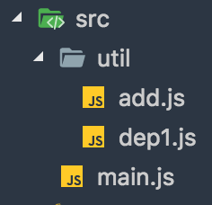

# webpack4.0性能优化


[webapck4 新特性介绍-参考资料](http://ju.outofmemory.cn/entry/343762)

当前依赖包的版本


## 1.优化loader配置

### 1.1 缩小文件匹配范围(include/exclude)

> 通过排除node_modules下的文件 从而缩小了loader加载搜索范围 高概率命中文件
```
    module: {
        rules: [
            {
                test: /\.js$/,
                use: 'babel-loader',
                exclude: /node_modules/, // 排除不处理的目录
                include: path.resolve(__dirname, 'src') // 精确指定要处理的目录
            }
        ]
    }
```

### 1.2 缓存loader的执行结果(cacheDirectory)

> cacheDirectory是loader的一个特定的选项，默认值是false。指定的目录(use: 'babel-loader?cacheDirectory=cacheLoader')将用来缓存loader的执行结果，减少webpack构建时Babel重新编译过程。如果设置一个空值(use: 'babel-loader?cacheDirectory') 或true(use: 'babel-loader?cacheDirectory=true') 将使用默认的缓存目录(node_modules/.cache/babel-loader)，如果在任何根目录下都没有找到 node_modules 目录，将会降级回退到操作系统默认的临时文件目录。

```
module: {
    rules: [
        {
            test: /\.js$/,
            use: 'babel-loader?cacheDirectory', // 缓存loader执行结果 发现打包速度已经明显提升了
            exclude: /node_modules/,
            include: path.resolve(__dirname, 'src')
        }
    ]
}

```

## 2.resolve优化配置

### 2.1 优化模块查找路径 resolve.modules

> Webpack的resolve.modules配置模块库（即 node_modules）所在的位置，在 js 里出现  import 'vue' 这样不是相对、也不是绝对路径的写法时，会去 node_modules 目录下找。但是默认的配置，会采用向上递归搜索的方式去寻找，但通常项目目录里只有一个 node_modules，且是在项目根目录，为了减少搜索范围，可以直接写明 node_modules 的全路径；同样，对于别名(alias)的配置，亦当如此：



```
const path = require('path');

function resolve(dir) { // 转换为绝对路径
   return path.join(__dirname, dir);
}

resolve: {
    modules: [ // 优化模块查找路径
        path.resolve('src'),
        path.resolve('node_modules') // 指定node_modules所在位置 当你import 第三方模块时 直接从这个路径下搜索寻找
    ]
}

```

配置好src目录所在位置后，由于util目录是在src里面 所以可以用下面方式引入util中的工具函数

```
// main.js

import dep1 from 'util/dep1';
import add from 'util/add';
```

### 2.2 resolve.alias 配置路径别名

> 创建 import 或 require 的路径别名，来确保模块引入变得更简单。配置项通过别名来把原导入路径映射成一个新的导入路径 此优化方法会影响使用Tree-Shaking去除无效代码

例如，一些位于 src/ 文件夹下的常用模块：

```
alias: {
  Utilities: path.resolve(__dirname, 'src/utilities/'),
  Templates: path.resolve(__dirname, 'src/templates/')
}
```

现在，替换「在导入时使用相对路径」这种方式，就像这样：

```
import Utility from '../../utilities/utility';
```

你可以这样使用别名：

```
import Utility from 'Utilities/utility';
```

```
resolve: {
    alias: { // 别名配置 通过别名配置 可以让我们引用变的简单
        'vue$': 'vue/dist/vue.common.js', // $表示精确匹配
        src: resolve('src') // 当你在任何需要导入src下面的文件时可以 import moduleA from 'src/moduleA' src会被替换为resolve('src') 返回的绝对路径 而不需要相对路径形式导入
    }
}
```
也可以在给定对象的键后的末尾添加 $，以表示精准匹配：

```
alias: {
    util$: resolve('src/util/add.js')
}
```

这将产生以下结果：

```
import Test1 from 'util'; // 精确匹配，所以 src/util/add.js 被解析和导入
import Test2 from 'util/dep1.js'; // 精确匹配，触发普通解析 util/dep1.js
```

## resolve.extensions
> 当引入模块时不带文件后缀 webpack会根据此配置自动解析确定的文件后缀

- 后缀列表尽可能小
- 频率最高的往前放
- 导出语句尽可能带上后缀

```
resolve: {
    extensions: ['.js', '.vue']
}
```

## 3.module.noParse
> 用了noParse的模块将不会被loaders解析，所以当我们使用的库如果太大，并且其中不包含import require、define的调用，我们就可以使用这项配置来提升性能, 让 Webpack 忽略对部分没采用模块化的文件的递归解析处理。

```
// 忽略对jquery lodash的进行递归解析
module: {
    // noParse: /jquery|lodash/

    // 从 webpack 3.0.0 开始
    noParse: function(content) {
        return /jquery|lodash/.test(content)
    }
}
```

## 4.HappyPack

> HappyPack是让webpack对loader的执行过程，从单一进程形式扩展为多进程模式，也就是将任务分解给多个子进程去并发的执行，子进程处理完后再把结果发送给主进程。从而加速代码构建 与 DLL动态链接库结合来使用更佳。

```
npm i happypack@next -D
```

webpack.config.js
```
const HappyPack = require('happypack');
const os = require('os'); // node 提供的系统操作模块

 // 根据我的系统的内核数量 指定线程池个数 也可以其他数量
const happyThreadPool = HappyPack.ThreadPool({size: os.cpus().lenght})

module: {
    rules: [
       {
           test: /\.js$/,
           use: 'happypack/loader?id=babel',
           exclude: /node_modules/,
           include: path.resolve(__dirname, 'src')
       }
    ]
},
plugins: [
    new HappyPack({ // 基础参数设置
        id: 'babel', // 上面loader?后面指定的id
        loaders: ['babel-loader?cacheDirectory'], // 实际匹配处理的loader
        threadPool: happyThreadPool,
        // cache: true // 已被弃用
        verbose: true
    });
]

```

happypack提供的loader，是对文件实际匹配的处理loader。这里happypack提供的loader与plugin的衔接匹配，则是通过id=happypack来完成。 资料:[happypack原理解析-淘宝前端](http://taobaofed.org/blog/2016/12/08/happypack-source-code-analysis/)

```
npm run dev
```

## 5.DLL动态链接库

> 在一个动态链接库中可以包含其他模块调用的函数和数据，动态链接库只需被编译一次，在之后的构建过程中被动态链接库包含的模块将不会被重新编译,而是直接使用动态链接库中的代码。

- 将web应用依赖的基础模块抽离出来，打包到单独的动态链接库中。一个链接库可以包含多个模块。
- 当需要导入的模块存在于动态链接库，模块不会再次打包，而是去动态链接库中去获取。
- 页面依赖的所有动态链接库都需要被加载。

5.1 定义DLL配置

> 依赖的两个内置插件：DllPlugin 和 DllReferencePlugin

5.1.1 创建一个DLL配置文件webpack_dll.config.js

```
module.exports = {
    entry: {
        react: ['react', 'react-dom']
    },
    output: {
        filename: '[name].dll.js', // 动态链接库输出的文件名称
        path: path.join(__dirname, 'dist'), // 动态链接库输出路径
        libraryTarget: 'var', // 链接库(react.dll.js)输出方式 默认'var'形式赋给变量 b
        library: '_dll_[name]_[hash]' // 全局变量名称 导出库将被以var的形式赋给这个全局变量 通过这个变量获取到里面模块
    },
    plugins: [
        new webpack.DllPlugin({
            // path 指定manifest文件的输出路径
            path: path.join(__dirname, 'dist', '[name].manifest.json'),
            name: '_dll_[name]_[hash]', // 和library 一致，输出的manifest.json中的name值
        })
    ]
}
```

5.1.2 output.libraryTarget
规定了以哪一种导出你的库  默认以全局变量形式 浏览器支持的形式


具体包括如下：

- "var" - 以直接变量输出(默认library方式) var Library = xxx (default)

- "this" - 通过设置this的属性输出 this["Library"] = xxx

- "commonjs" - 通过设置exports的属性输出 exports["Library"] = xxx

- "commonjs2" - 通过设置module.exports的属性输出 module.exports = xxx

- "amd" - 以amd方式输出

- "umd" - 结合commonjs2/amd/root


5.1.3 打包生成动态链接库

```
webpack --config webpack_dll.config.js --mode production
```


在dist目录下 多出react.dll.js 和 react.manifest.json
- react.dll.js 动态链接库 里面包含了 react和react-dom的内容
- react.manifest.json 描述链接库(react.dll)中的信息

5.2 在主配置文件中使用动态链接库文件

```
// webpack.config.js

const webpack = require('webpack');

plugins: [
    // 当我们需要使用动态链接库时 首先会找到manifest文件 得到name值记录的全局变量名称 然后找到动态链接库文件 进行加载
    new webpack.DllReferencePlugin({
       manifest: require('./dist/react.manifest.json')
    })
]
```

5.3 将动态链接库文件加载到页面中

需要借助两个webpack插件

- html-webpack-plugin 产出html文件
- html-webpack-include-assets-plugin 将js css资源添加到html中 扩展html插件的功能

```
npm i html-webpack-plugin html-webpack-include-assets-plugin -D
```

配置webpack.config.js
```
const webpack = require('webpack');
const HtmlWebpackPlugin = require('html-webpack-plugin');
const HtmlIncludeAssetsPlugin = require('html-webpack-include-assets-plugin');

pluings: [
    new webpack.DllReferencePlugin({
       manifest: require('./dist/react.manifest.json')
    }),
    new HtmlWebpackPlugin({
       template: path.join(__dirname, 'src/index.html')
    }),
    new HtmlIncludeAssetsPlugin({
        assets: ['./react.dll.js'], // 添加的资源相对html的路径
        append: false // false 在其他资源的之前添加 true 在其他资源之后添加
    });
]
```

此时react.dll.js和main.js被自动引入到页面中，并且dll文件在main.js之前加载


## 6.ParallelUglifyPlugin

> 这个插件可以帮助有很多入口点的项目加快构建速度。把对JS文件的串行压缩变为开启多个子进程并行进行uglify。

```
cnpm i webpack-parallel-uglify-plugin -D
```

```
// webpck.config.js

const ParallelUglifyPlugin = require('webpack-parallel-uglify-plugin');

plugins: [
    new ParallelUglifyPlugin({
        workerCount: 4,
        uglifyJS: {
            output: {
                beautify: false, // 不需要格式化
                comments: false // 保留注释
            },
            compress: { // 压缩
                warnings: false, // 删除无用代码时不输出警告
                drop_console: true, // 删除console语句
                collapse_vars: true, // 内嵌定义了但是只有用到一次的变量
                reduce_vars: true // 提取出出现多次但是没有定义成变量去引用的静态值
            }
        }
    });
]

```
执行压缩
```
webpack --mode production
```
## 7.Tree Shaking
> 剔除JavaScript中用不上的代码。它依赖静态的ES6模块化语法，例如通过impot和export导入导出

### commonJS模块 与 es6模块的区别

commonJS模块：

- 1.动态加载模块
commonJS 是运行时加载 能够轻松实现懒加载，优化用户体验

- 2.加载整个模块
commonJS模块中，导出的是整个模块

- 3.每个模块皆为对象
commonJS模块被视作一个对象

- 4.值拷贝
commonJS的模块输出和函数的值传递相似，都是值得拷贝

es6模块
- 1.静态解析
es6模块时 编译时加载 即在解析阶段就确定输出的模块的依赖关系，所以es6模块的import一般写在被引入文件的开头

- 2.模块不是对象
在es6里，每个模块并不会当做一个对象看待

- 3.加载的不是整个模块
在es6模块中 一个模块中有好几个export导出

- 4.模块的引用
es6模块中，导出的并不是模块的值得拷贝，而是这个模块的引用

7.1 保留ES6模块化语法

```
// .babelrc

{
    "presets": [
        [
           "env", {
               modules: false // 不要编译ES6模块
           },
           "react",
           "stage-0"
        ]
    ]
}
```

7.2 执行生产编译 默认已开启Tree Shaking

```
webpack --mode production
```

### 什么是Tree Shaking?

有个funs.js 里面有两个函数

```
// funs.js
export const sub = () => 'hello webpack!';
export const mul = () => 'hello shaking!';
```

main.js 中依赖funs.js

```
// main.js
import {sub} from './funs.js'

sub();

```
在main.js只使用了里面的 sub函数 默认情况下也会将funs.js里面其他没有的函数也打包进来, 如果开启tree shaking 生产编译时

```
webpack --mode production  //此时funs.js中没有被用到的代码并没打包进来 而被剔除出去了
```

## 区分环境
> 通常我们在开发网页时需要区分构建环境

- 开发环境(development) 开发过程中方便开发调试的环境
- 生产环境(production) 发布到线上使用的运行环境


### 通过npm命令区分

通过cross-env模块设置环境变量
> cross-env 跨平台地设置及使用环境变量,而不必担心为平台正确设置或使用环境变量。
```
npm i cross-env -D
```

### Usage

npm scripts中:

```
{
    "scripts": {
        "build": "cross-env NODE_ENV=production webpack --mode production",
        "dev": "cross-env NODE_ENV=development webpack-dev-server --mode development",
    }
}
```

执行npm命令切换环境
```
npm run build // 生产环境 process.env.NODE_ENV === 'production'
npm run dev // 开发环境 process.env.NODE_ENV === 'development'
```

接下来我们就可以在webpack.config.js 通过process.env.NODE_ENV来得知当前环境标识

### 代码中区分环境

#### 定义环境常量
webpack4以前都是通过DefinePlugin来定义NODE_ENV环境变量，以决定library中应该引用哪些内容。

> NODE_ENV是一个由Node.js暴露给执行脚本的环境变量。通常用于决定在开发环境与生产环境下，服务工具、构建脚本和客户端library的行为。

在webpack.config.js 中添加DefinePlugin插件

```
const webpack = require('webpack');

plugins: [
    new webpack.DefinePlugn({
       'process.env': {
           'NODE_ENV': JSON.stringify(process.env.NODE_ENV)
       }
    })
]
```


在main.js中通过判断process.env.NODE_ENV常量 来执行相应逻辑

#### mode模式配置
> 在webpack4 增加了mode模式配置 process.env.NODE_ENV 的值不需要再定义，默认是development
mode 是 webpack 4 中新增加的参数选项，其有两个可选值：production 和 development。mode 不可缺省，需要二选一：

##### production 模式：

- 1.生产环境默认开启了很多代码优化（minify，splite等）
- 2.开发时开启注视和验证，并且自动加上了eval devtool
- 3.生产环境不支持watching，开发环境优化了重新打包的速度
- 4.默认开启了Scope hoisting和Tree-shaking（原ModuleConcatenationPlugin）
- 5.自动设置process.env.NODE_ENV到不同环境，也就是不需要DefinePlugin来做这个了
- 6.如果你给mode设置为none，所有默认配置都去掉了
- 7.如果不加这个配置webpack会出现提醒，所以还是加上吧

#### development 模式：

- 1.主要优化了增量构建速度和开发体验

- 2.process.env.NODE_ENV 的值不需要再定义，默认是 development

- 3.开发模式下支持注释和提示，并且支持 eval 下的 source maps


```
const NODE_ENV = process.env.NODE_ENV;
if (NODE_ENV === 'development') { // 开发环境下执行下面代码
    console.log('development', NODE_ENV);
} else { // 生产环境则执行以下环境
    console.log('production', NODE_ENV);
}

```

#### DefinePlugn
> DefinePlugin 允许创建一个在编译时可以配置的全局常量。这可能会对开发模式和发布模式的构建允许不同的行为非常有用。

### webpack配置中区分环境

在项目目录中添加webpack配置文件

- webpack.base.config.js 保存webpack基础通用的配置的文件
- webpack.dev.config.js  保存webpack开发环境配置的文件
- webpack.prod.config.js 保存webpack生成环境配置的文件
- webpack.config.js webpack执行配置文件 保存相应环境的配置和webpack基础配置文件合并后的配置

### 基础配置 webpack.base.config.js
webpack一些loader配置

```
const path = require('path');
const webpack = require('webpack');
const HtmlWebpackPlugin = require('html-webpack-plugin');

const HappyPack = require('happypack');
const os = require('os'); // 系统操作函数
const happyThreadPool = HappyPack.ThreadPool({size: os.cpus().length}); // 指定线程池个数

function resolve(dir) {
    return path.join(__dirname, dir);
}

module.exports = {
    entry: {
        app: './src/main.js'
    },
    output: {
        path: path.join(__dirname, 'dist'),
        filename: '[name].js'
    },
    module: {
        rules: [
            {
                test: /\.js$/,
                // use: 'babel-loader?cacheDirectory'
                use: 'happypack/loader?id=babel', // 缓存loader执行结果
                exclude: /node_modules/, // 排除不要加载的文件夹
                include: path.resolve(__dirname, 'src') // 指定需要加载的文件夹
            }
        ],
        noParse: function(content) { // content 从入口开始解析的模块路径
            return /no-parser/.test(content); // 返回true则忽略对no-parser.js的解析
        }
    },
    resolve: {
        modules: [ // 优化模块查找路径
            resolve('src'),
            resolve('node_modules') // 指定node_modules所在位置 当你import第三方模块式 直接从这个路径下搜寻
        ],
        alias: {
            funs$: resolve('src/util/funs.js')
        },
        extensions: ['.js', '.vue']
    },
    plugins: [
        new webpack.DefinePlugin({ // 定义环境变量
            "process.env": JSON.stringify(process.env.NODE_ENV)
        }),
        new HappyPack({
            id: 'babel',
            loaders: ['babel-loader?cacheDirectory'],
            threadPool: happyThreadPool,
            verbose: true
        }),
        new HtmlWebpackPlugin({
            template: resolve('index.html'),
            title: 'hello webpack!'
        })
    ]
}
```

### 开发配置webpack.dev.config.js

> 开发时的输入输出以及开发调试配置 如 devServer devtool 配置
```
const webpack = require('webpack');

module.exports = {
    plugins: [
       new webpack.DefinePlugin({
           'process.env': {
               'NODE_ENV': JSON.stringify(process.env.NODE_ENV)
           }
       })
    ],
    devServer: {
        contentBase: resolve('dist'),
        compress: true,
        port: 9000
    }
};
```

### 生成环境webpack.prod.config.js

> 生成环境 进行压缩 代码分离等代码优化 线上配置
```
const webpack = require('webpack');
const path = require('path');
const ParallelUglifyPlugin = require('webpack-parallel-uglify-plugin');
const HtmlWebpackPlugin = require('html-webpack-plugin');
const HtmlIncludeAssetsPlugin = require('html-webpack-include-assets-plugin');

module.exports = {
    plugins: [
        new webpack.DllReferencePlugin({
            manifest: require(path.join(__dirname, 'dll', 'react.manifest.json'))
        }),
        new ParallelUglifyPlugin({
            workerCount: 4, // 开启几个子进程去并发的执行压缩，默认是当前电脑的cpu数量减1
            uglifyJS: {
                output: {
                    beautify: false, // 不需要格式化
                    comments: false // 保留注释
                },
                compress: {
                    warnings: false, // Uglifyjs 删除没有代码时，不输出警告
                    // drop_console: true, // 删除所有console语句
                    collapse_vars: true,
                    reduce_vars: true
                }
            }
        }),
        new HtmlWebpackPlugin({
            template: path.join(__dirname, 'index.html')
        }),
        new HtmlIncludeAssetsPlugin({
            assets: ['/dll/react.dll.js'],
            append: false
        })
    ]
};
```

### webpack.config.js 配置合并
借助webpack-merge 将base配置和相应环境配置 合并到'webpack.config.js'

```
npm i webpack-merge -D
```

webpack.config.js

```
const base = require('./webpack.base.config');
const merge = require('webpack-merge');

let config;
if (process.env.NODE_ENV === 'production') {
    config = require('./webpack.prod.config');
} else {
    config = require('./webpack.dev.config');
}

module.exports = merge(base, config);
```

运行生产配置
```
npm run build
```

运行开发配置
```
npm run dev
```


## 实时重新加载(live reloading) 和 模块热替换(HMR)
> webpack-dev-server 为你提供了一个简单的 web 服务器，并且能够实时重新加载(live reloading)。

让我们设置以下：

```
    npm i webpack-dev-server -D
```

配置webpack.dev.config.js

```
devServer: {
    contentBase: path.join(__dirname, 'dist'), // 将 dist 目录下的文件，作为可访问文件。
    compress: true, // 开启Gzip压缩
    port: 9000, // 端口号
    inline: true // 在打包后文件里注入一个websocket客户端
}
```

npm scripts

```
{
    "scripts": {
        "dev": "cross-env NODE_ENV=development webpack-dev-server --mode development"
    }
}
```

启动server

```
npm run dev
```
浏览器访问localhost:9000 当修改代码ctrl+s 将自动刷新浏览器

## 启用HMR
> 模块热替换(Hot Module Replacement 或 HMR)是 webpack 提供的最有用的功能之一。它允许在运行时更新各种模块，而无需进行完全刷新。

配置webpack.dev.config.js

```
devServer: {
    contentBase: path.join(__dirname, 'dist'),
    compress: true,
    port: 9000,
    inline: true,
    hot: true // 开启HMR
}
```

注意 此外我们还需添加NamedModulesPlugin 和 HotModuleReplacementPlugin 插件

webpack.dev.config.js
```
{
    plugins: [
        new webpack.NamedModulesPlugin(),
        new webpack.HotModuleReplacementPlugin()
    ]
}
```

### 其他代码和框架开启热替换

1. React Hot Loader（实时调整 react 组件）

Install

```
npm install react-hot-loader
```

Getting started

1.1 Add react-hot-loader/babel to your .babelrc:

```
// .babelrc

{
    "plugins": ["react-hot-loader"]
}
```

1.2 Mark your root component as hot-exported:
```
// App.js
import React from 'react'
import { hot } from 'react-hot-loader'

const App = () => <div>Hello World!</div>

export default hot(module)(App)
```

2. Vue loader
> vue-cli 已经集成 只需用vue-cli脚手架开发即可


 - [react-hot-loader](https://github.com/gaearon/react-hot-loader)
 - [vue-loader](https://github.com/vuejs/vue-loader)

### HMR 修改样式表
> 借助于 style-loader 的帮助，CSS 的模块热替换实际上是相当简单的。当更新 CSS 依赖模块时，此 loader 在后台使用 module.hot.accept 来修补(patch) <style> 标签。

可以使用以下命令安装两个 loader ：

```
npm install --save-dev style-loader css-loader
```

配置webpack.base.config.js

```
const path = require('path');
const HtmlWebpackPlugin = require('html-webpack-plugin');
const webpack = require('webpack');

module.exports = {
  entry: {
    app: './src/index.js'
  },
  devtool: 'inline-source-map',
  devServer: {
    contentBase: './dist',
    hot: true
  },
+   module: {
+     rules: [
+       {
+         test: /\.css$/,
+         use: ['style-loader', 'css-loader']
+       }
+     ]
+   },
  plugins: [
    new HtmlWebpackPlugin({
      title: 'Hot Module Replacement'
    }),
    new webpack.HotModuleReplacementPlugin()
  ],
  output: {
    filename: '[name].bundle.js',
    path: path.resolve(__dirname, 'dist')
  }
};
```

### HMR参考配置
[HMR参考](http://www.css88.com/doc/webpack/guides/hot-module-replacement/)

## 提取公共代码与第三方代码
> 将多个入口重复加载的公共资源提取出来

- 相同的资源被重复的加载，浪费用户的流量和服务器的成本；
- 每个页面需要加载的资源太大，导致网页首屏加载缓慢，影响用户体验。 如果能把公共代码抽离成单独文件进行加载能进行优化，可以减少网络传输流量，降低服务器成本

* 在webpack4.0 optimization.splitChunks替代了CommonsChunkPlugin

webpack.base.config.js提取配置
```
optimization: {
    // runtimeChunk: {
    //     name: "manifest"
    // },
    splitChunks: {
        cacheGroups: {
            commons: {
                chunks: 'initial',
                minChunks: 2,
                maxInitialRequests: 5,
                minSize: 0
            },
            vendor: { // 将第三方模块提取出来
                test: /node_modules/,
                chunks: 'initial',
                name: 'vendor',
                priority: 10, // 优先
                enforce: true
            }
        }
    }
}
```

optimization参数介绍：

```
optimization: {
    splitChunks: {
      chunks: "initial",         // 必须三选一： "initial" | "all"(默认就是all) | "async"
      minSize: 0,                // 最小尺寸，默认0
      minChunks: 1,              // 最小 chunk ，默认1
      maxAsyncRequests: 1,       // 最大异步请求数， 默认1
      maxInitialRequests: 1,     // 最大初始化请求书，默认1
      name: () => {},            // 名称，此选项课接收 function
      cacheGroups: {                // 这里开始设置缓存的 chunks
        priority: "0",              // 缓存组优先级 false | object |
        vendor: {                   // key 为entry中定义的 入口名称
          chunks: "initial",        // 必须三选一： "initial" | "all" | "async"(默认就是异步)
          test: /react|lodash/,     // 正则规则验证，如果符合就提取 chunk
          name: "vendor",           // 要缓存的 分隔出来的 chunk 名称
          minSize: 0,
          minChunks: 1,
          enforce: true,
          maxAsyncRequests: 1,       // 最大异步请求数， 默认1
          maxInitialRequests: 1,     // 最大初始化请求书，默认1
          reuseExistingChunk: true   // 可设置是否重用该chunk（查看源码没有发现默认值）
        }
      }
    }
  }
```


## 懒加载(按需加载)
> 是一种很好的优化网页或应用的方式。这种方式实际上是先把你的代码在一些逻辑断点处分离开，然后在一些代码块中完成某些操作后，立即引用或即将引用另外一些新的代码块。这样加快了应用的初始加载速度，减轻了它的总体体积，因为某些代码块可能永远不会被加载。

lazy.js
```
export default 'lazy loader';
```

main.js 当点击按钮时 再加载lazy.js 输出里面内容

```
let output = () => {
    import('./lazy').then(module => {
        console.log(module.default);
    });
};
ReactDOM.render(
    <div>
    <button onClick={output}>点击</button>
    </div>,
    document.querySelector('#root')
)
```

### vue中懒加载

```
const Login = () => import('./login')

new VueRouter({
  routes: [
    { path: '/login', component: Login }
  ]
})
```

### react中懒加载

```
babel-plugin-syntax-dynamic-import plugin. This is a syntax-only plugin, meaning Babel won’t do any additional transformations. The plugin simply allows Babel to parse dynamic imports so webpack can bundle them as a code split. Your .babelrc should look something like this:{
  "presets": [
    "react"
  ],
  "plugins": [
    "syntax-dynamic-import"
  ]
}
react-loadable is a higher-order component for loading components with dynamic imports. It handles all sorts of edge cases automatically and makes code splitting simple! Here’s an example of how to use react-loadable:import Loadable from 'react-loadable';
import Loading from './Loading';

const LoadableComponent = Loadable({
  loader: () => import('./Dashboard'),
  loading: Loading,
})

export default class LoadableDashboard extends React.Component {
  render() {
    return <LoadableComponent />;
  }
}
```

## 开启Scope Hoisting
> 在webpack4中当mode为production时默认开启了Scope Hoisting 可以让webpack打包出来的代码文件更小、运行更快，它又译作“作用域提升”。

好处：
• 代码体积更小，因为函数申明语句会产生大量代码；
• 代码在运行时因为创建的函数作用域更少了，内存开销也随之变小

scope.js

```
export default 'scope hoisting'
```

main1.js

```
import scope from './scope';
console.log(scope);
```

webpack3 配置scope Hoisting

```
new webpack.optimize.ModuleConcatenationPlugin()
```

开启scope hoisting后的代码

```
// CONCATENATED MODULE: ./src/scope.js
/* harmony default export */ var scope = ('scope hoisting');
// CONCATENATED MODULE: ./src/main1.js

console.log(scope);
```

ES6的静态模块分析，分析出模块之间的依赖关系，尽可能地把模块放到同一个函数中。


同时，考虑到 Scope Hoisting 依赖源码需采用 ES6 模块化语法，还需要配置 mainFields。因为大部分 Npm 中的第三方库采用了 CommonJS 语法，但部分库会同时提供 ES6 模块化的代码，为了充分发挥 Scope Hoisting 的作用，需要增加以下配置

mainFields用于配置第三方模块使用那个入口文件
```
module.exports = {
  resolve: {
    // 针对 Npm 中的第三方模块优先采用 jsnext:main 中指向的 ES6 模块化语法的文件
    mainFields: ['jsnext:main', 'browser', 'main']
  },
};
```

对于采用了非 ES6 模块化语法的代码，Webpack 会降级处理不使用 Scope Hoisting 优化


## 源码参考
[GitHub源码](https://github.com/Lwenli1224/webapck-opt.git)

## 掘金文章

- [webpack4.0打包优化策略(一)](https://juejin.im/post/5abbc2ca5188257ddb0fae9b)
- [webpack4.0打包优化策略(二)](https://juejin.im/post/5ac75717518825557459f12b)
- [webpack4.0打包优化策略(三)](https://juejin.im/post/5ac76a8f51882555677ecc06)

## 参考资料
- [webpack中文官网](https://doc.webpack-china.org/guides/)
- [webpack中文](http://www.css88.com/doc/webpack/guides/)
- [webpack常用配置拆分](https://www.imooc.com/article/10969)
- [webpack4特性](https://www.imooc.com/article/23555?block_id=tuijian_wz)
- [webpack examples](https://github.com/webpack/webpack/tree/master/examples)
